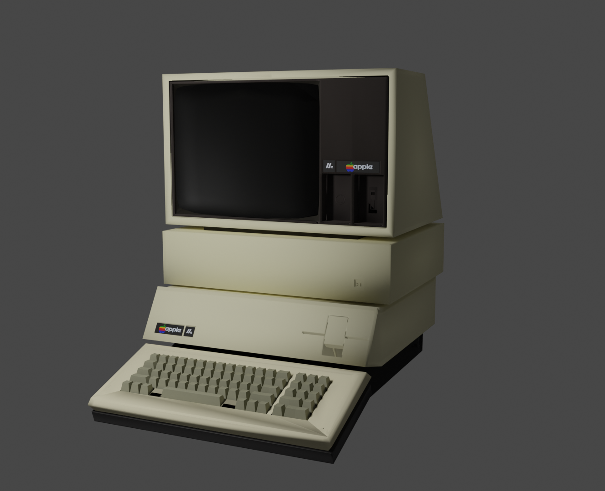
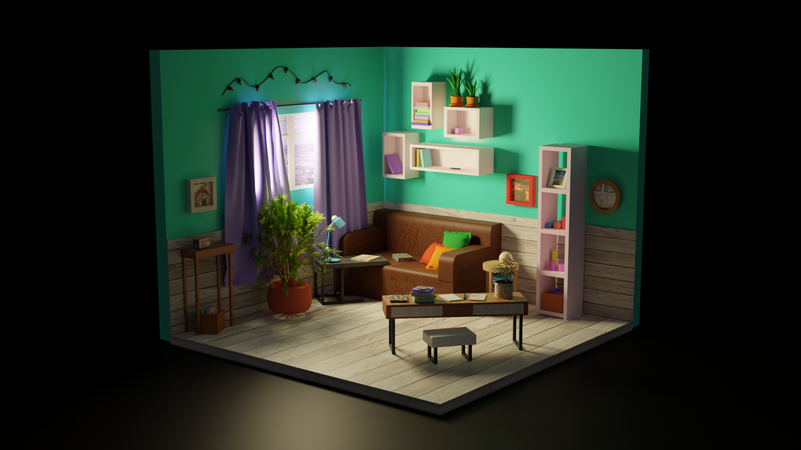
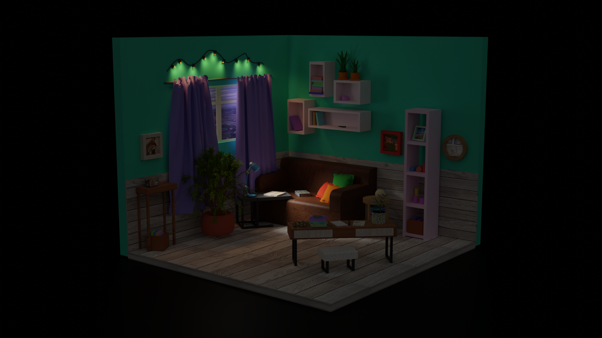
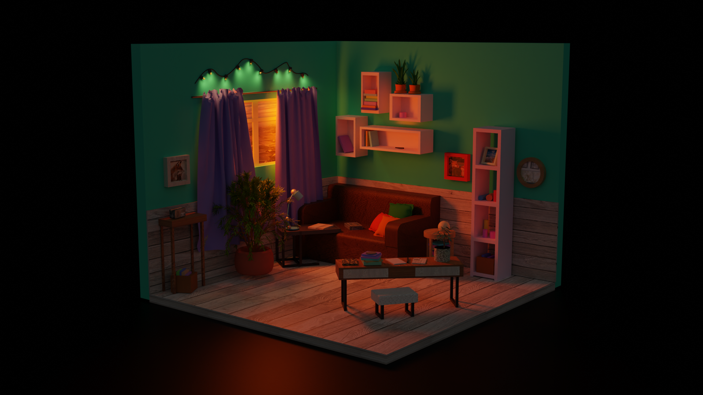

# 3D-modeling
Работы по 3D-моделированию
1. Диорама - небольшая локация с интерактивными сценариями. Ссылка на видео: [link](https://drive.google.com/drive/folders/14cF1fBSUh6gC4VhJ8Jup6jHUhXOhgrmJ?usp=sharing)
2. Персонаж, внедренный в локацию. Реализация игровых механик. Моделирование персонажа, его оптимизация, риггинг, реализация движения и игровых механик (сбор предметов). Ссылка на видео: [link](https://drive.google.com/file/d/1bVe8iMUSynzKAY-tauApjYr3eMnTx8Xt/view?usp=sharing)
3. Персонаж с анимацией, риггинг, монтаж видеоролика: [link](https://drive.google.com/file/d/1gPXha2qPYVbJQdYoBEzLQbo2kOvylRGK/view?usp=sharing)
4. Моделирование предмета по референсу. Оптимизация модели.

6. Комната - ручное моделирование комнаты по референсу. Постановка дневного, закатного и ночного освещения

